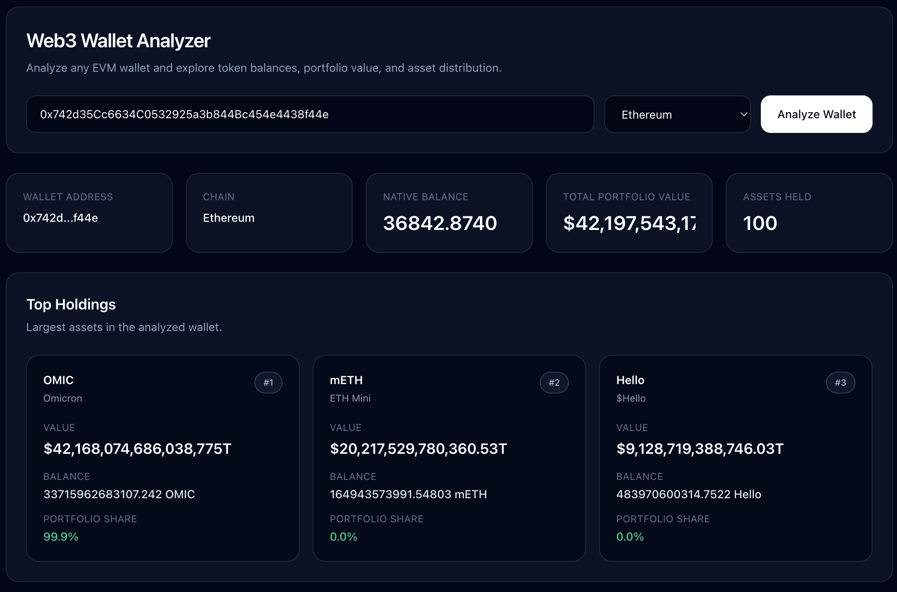
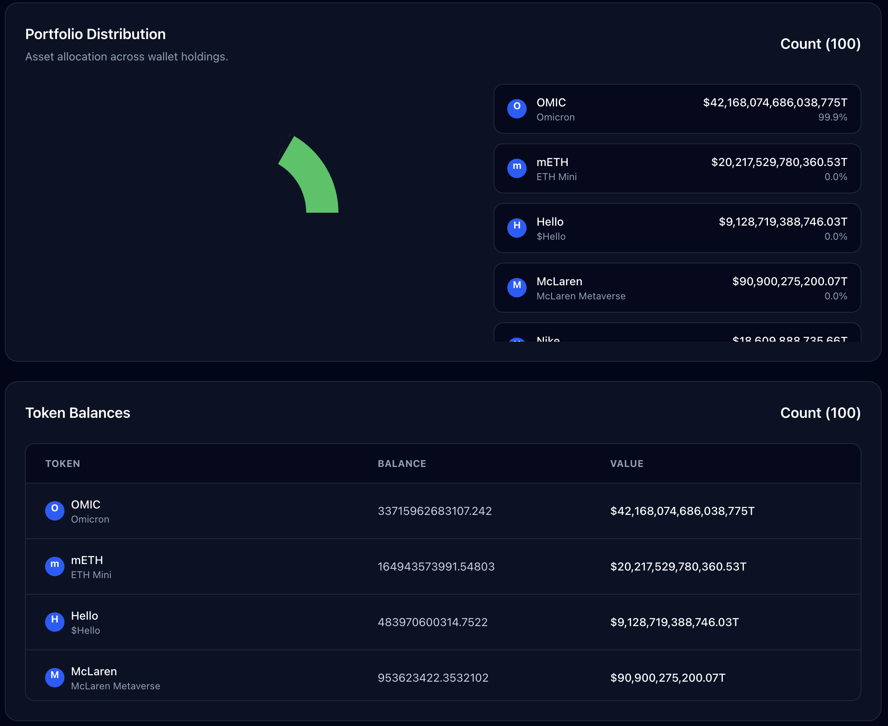

# Web3 Wallet Analyzer

⭐ If you find this useful, please star the repo — it helps a lot!

Analyze any crypto wallet across multiple chains.

View token balances, portfolio value, and asset distribution instantly.

Built with **Next.js, TypeScript, Viem, Moralis, and Tailwind CSS**.

---

## 💡 Why This Project

Most wallet explorers are:
- slow
- cluttered
- limited to one chain

This tool provides a **clean, fast, and multi-chain wallet experience**.

---

## 🚀 Live Demo

https://web3-wallet-analyzer.vercel.app/

---

## 📸 Preview




---

## ✨ Features

- 🔎 Analyze any EVM wallet instantly
- 🌐 Multi-chain support (Ethereum, Polygon, Base, Arbitrum, BNB)
- 💰 Real-time token balances
- 📊 Interactive portfolio distribution chart
- 🏆 Top holdings breakdown
- 🧾 Detailed token table with prices
- ⚡ Fast and responsive UI

---

## 🧰 Tech Stack

- **Next.js (App Router)**
- **TypeScript**
- **Viem** (on-chain data)
- **Moralis API** (token balances + pricing)
- **Recharts** (data visualization)
- **Tailwind CSS**

---

## 🧠 How It Works

1. User enters wallet address
2. App validates address
3. Fetches:
   - Native balance (via Viem)
   - Token balances (via Moralis)
4. Calculates:
   - Total portfolio value
   - Token distribution
5. Displays charts + tables

---

## ⚙️ Setup

### 1. Clone repo

```bash
git clone git@github.com:khalilahmed63/web3-wallet-analyzer.git
cd web3-wallet-analyzer
```

### 2. Install dependencies

```bash
npm install
```

### 3. Add environment variables

Create a `.env.local` file in the root directory:

```bash
MORALIS_API_KEY=your_api_key_here
```

### 🔑 Get Moralis API Key

1. Go to https://moralis.io/
2. Sign up / log in
3. Create a new project
4. Copy your API key
5. Add it to `.env.local`

### 4. Run project

```bash
npm run dev
```

Open

```bash
http://localhost:3000
```

---

## 🧪 Try It With

Example wallet:

```bash
0x742d35Cc6634C0532925a3b844Bc454e4438f44e
```

Paste it into the app to see real data.

## 🌍 Supported Chains

- Ethereum
- Polygon
- Base
- Arbitrum
- BNB Chain

📈 **Future Improvements**

- Real-time price updates
- NFT support
- Transaction history
- Cross-chain portfolio view
- Wallet PnL tracking

🤝 **Contributing**

Contributions are welcome!

Feel free to:

- Open issues
- Submit PRs
- Suggest improvements

👨‍💻 **Author**

_Khalil Ahmed_

Frontend Engineer building Web3 analytics platforms.

Portfolio: https://www.khalilahmed.dev
LinkedIn: https://www.linkedin.com/in/khalil-ahmed-308a061a6
GitHub: https://github.com/khalilahmed63

⭐ **Support**

If you find this project useful, please ⭐ the repo!
